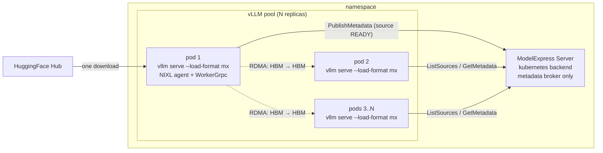

# ModelExpress P2P Weight Transfer

## Overview

This guide layers [NVIDIA ModelExpress](https://github.com/ai-dynamo/modelexpress) on top of the [Optimized Baseline](../optimized-baseline/README.md) deployment to move cold-start weight loading off disk and onto **GPU-to-GPU NIXL/RDMA**. One pod in the inference pool loads weights from HuggingFace; every other pod receives the same weights directly from that pod's HBM over the RDMA fabric, skipping disk entirely.

A central-coordinator ModelExpress server (running with the `kubernetes` metadata backend) brokers the metadata exchange: it tracks which pods are READY sources for which `mx_source_id`, and hands target pods the NIXL agent + tensor-manifest endpoints they need to start an RDMA pull. The server itself never touches weight bytes.

Concretely, for an `N`-replica deployment of `meta-llama/Llama-3.3-70B-Instruct` (~140 GB of bf16 weights):

* Without ModelExpress, every vLLM pod pulls ~140 GB from HuggingFace at startup. N times the cluster egress, N times the slow path, plus disk-to-GPU load time on every pod.
* With this guide, the first pod to come up does the HuggingFace download, registers its tensors with NIXL, and publishes itself as a P2P source. Every other pod discovers that source via the ModelExpress server and pulls weights straight into GPU HBM over RDMA.

> This guide ships a default of **2 replicas (1 seed + 1 receiver)** to keep the GPU footprint small (4 GPUs at TP2) while still exercising a real HBM-to-HBM transfer. The amount of weight data moved over P2P grows with `(bytes per replica) x (number of receivers)`, so scale the pool wider when you want to observe a production fan-out. The optional measurement sections below show how to record P2P and storage-backed load times in your own environment.



### When to use this guide

Reach for P2P weight transfer when:

* Your inference pool has multiple replicas of the same model checkpoint.
* You have an InfiniBand, RoCE or EFA fabric exposed to pods as the `rdma/ib` extended resource (or the equivalent for your CNI / device plugin; the request lives in the `coreweave` overlay, see Step 3).
* You care about cold-start tail latency on scale-outs, rolling restarts, or live-refit workloads where many pods come up close together.

### Notes for specific workloads

**RL training rollouts.** Frameworks like [veRL](https://github.com/volcengine/verl),
[OpenRLHF](https://github.com/OpenRLHF/OpenRLHF),
[TRL's GRPO trainer](https://huggingface.co/docs/trl/main/en/grpo_trainer),
and [NeMo-RL](https://github.com/NVIDIA-NeMo/RL) run vLLM rollout workers with
`enforce_eager=True` because cudagraphs are invalidated on every policy weight
update and re-capturing them between training steps is prohibitive. For this
audience, the cudagraph capture caveat (see "Optional: Share torch.compile
cache across pods" below) doesn't apply — adding `--enforce-eager` to the args
in `patch-vllm.yaml` (or omitting `--load-format=mx`'s cudagraph-related
compilation entirely) puts receiver pod-Ready time in the 30–40 second range.

**Elastic / bin-packed inference on dense racks** (e.g. NVL72 hosting multiple model deployments that share a GPU budget). When the operator's goal is reshaping the GPU budget across model deployments in response to realtime load — tearing down replicas of one model to spin up replicas of another — the primary cold-start cost may be weight movement rather than cudagraph capture. This guide moves that path to P2P RDMA. The remaining tradeoff between scale-up latency and steady-state TPOT (cudagraphs vs `--enforce-eager`) is workload-specific and outside the scope of this guide.

## Default Configuration

| Component | Value |
| --- | --- |
| Model | [meta-llama/Llama-3.3-70B-Instruct](https://huggingface.co/meta-llama/Llama-3.3-70B-Instruct) (~140 GB, bf16, gated) |
| Replicas | 2 (1 seed + 1 receiver; scale wider for a real fan-out) |
| Tensor Parallelism | 2 |
| Total GPUs | 4 |
| Fabric resource | `rdma/ib` (2 per pod, via the `coreweave` overlay) |
| Image | `llm-d-cuda:v0.7.0` + ModelExpress client baked in (build it yourself, see [Image](#image-building-an-llm-d-cuda--modelexpress-image)) |
| MX backend | `kubernetes` (CRDs, no Redis) |
| Weight transport | NIXL/RDMA, GPU HBM -> GPU HBM |

## Prerequisites

* Have the [proper client tools installed on your local system](../../helpers/client-setup/README.md) to use this guide.
* A Kubernetes cluster with RDMA-capable GPU nodes (H100/H200 with InfiniBand recommended) and a device plugin exposing `rdma/ib` (or your fabric's equivalent; adjust the resource name in the `coreweave` overlay, see Step 3).
* Checkout llm-d repo:

  ```bash
  export branch="main" # branch, tag, or commit hash
  git clone https://github.com/llm-d/llm-d.git && cd llm-d && git checkout ${branch}
  ```

* Environment variables:

  ```bash
  export GAIE_VERSION=v1.5.0
  export ROUTER_CHART_VERSION=v0
  export GUIDE_NAME="modelexpress-p2p"
  # Override by exporting NAMESPACE before running these commands; the default
  # is used only if it's unset. Every command below is namespace-parameterized.
  export NAMESPACE=${NAMESPACE:-llm-d-modelexpress-p2p}
  ```

* Install the Gateway API Inference Extension CRDs:

  ```bash
  kubectl apply -k "https://github.com/kubernetes-sigs/gateway-api-inference-extension/config/crd?ref=${GAIE_VERSION}"
  ```

* Create the target namespace:

  ```bash
  kubectl create namespace ${NAMESPACE}
  ```

* The ModelExpress CRDs installed cluster-wide (one-time, by a cluster admin). This guide vendors the two CRDs (pinned to the upstream `v0.4.0` tag) so the shape stays locked against the `modelexpress-server:0.4.0` pin instead of drifting with upstream `main`:

  ```bash
  kubectl apply -f guides/${GUIDE_NAME}/modelexpress/crds.yaml
  ```

* An `nvcr-imagepullsecret` in the target namespace granting access to `nvcr.io/nvidia/ai-dynamo/modelexpress-server`. See the [ModelExpress Helm README](https://github.com/ai-dynamo/modelexpress/blob/main/helm/README.md#1-create-nvidia-container-registry-secret) for the secret recipe. Alternatively, you can build this image yourself and push to a local registry of your choice.
* A HuggingFace token secret. **Llama-3.3-70B is gated, so this is required** (the seed pod and the fastsafetensors prewarm Job both need it):

  ```bash
  kubectl create secret generic llm-d-hf-token \
      --from-literal=HF_TOKEN=<your-token> -n ${NAMESPACE}
  ```

### Image: building an llm-d-cuda + ModelExpress image

The `mx` load-format plugin lives in the [`modelexpress` Python client](https://github.com/ai-dynamo/modelexpress/tree/main/modelexpress_client/python), a pure-Python vLLM plugin (it imports vLLM, NIXL, and gRPC, all already present in `llm-d-cuda`).

> [!WARNING]
> **`ghcr.io/llm-d/llm-d-cuda:v0.7.0` does not ship the client** (verified: no `modelexpress` package, `mx` load-format unregistered). You need an image with the client baked in. Build a thin one on top of the base — this is the upstream [ModelExpress client Dockerfile](https://github.com/ai-dynamo/modelexpress/blob/main/examples/p2p_transfer_k8s/client/vllm/Dockerfile) recipe adapted to an `llm-d-cuda` base:

```dockerfile
# guides/modelexpress-p2p/image/Dockerfile
FROM ghcr.io/llm-d/llm-d-cuda:v0.7.0

# The ModelExpress vLLM client plugin (registers the `mx` / `modelexpress`
# load-format). Pure Python, so no native build step. `--no-deps` keeps it
# from shadowing the image's pinned vllm / torch / nixl. The llm-d-cuda
# image ships `uv`, not `pip`, so install into a dedicated prefix and put it
# on PYTHONPATH (the image's venv stays untouched).
ARG MODELEXPRESS_VERSION=0.4.0
RUN uv pip install --target=/opt/modelexpress --no-deps --no-cache \
        "modelexpress==${MODELEXPRESS_VERSION}"
ENV PYTHONPATH=/opt/modelexpress
```

Build it and push to a registry your cluster can pull from:

```bash
export MODELSERVER_IMAGE=<your-registry>/llm-d-cuda-modelexpress:v0.7.0
docker build -t ${MODELSERVER_IMAGE} guides/${GUIDE_NAME}/image/
docker push ${MODELSERVER_IMAGE}
```

Then point the model-server overlay at it (the `images:` entry in `base/kustomization.yaml` ships a `<your-registry>/...` placeholder):

```bash
cd guides/${GUIDE_NAME}/modelserver/gpu/vllm/base
kustomize edit set image REPLACE_MODEL_SERVER_IMAGE=${MODELSERVER_IMAGE}
cd -
```

With `VLLM_PLUGINS=modelexpress` set (already in `patch-vllm.yaml`), vLLM logs `Registered model loader ... with load format mx` at startup.

> The 0.4.0 client registers two load-format names: the canonical `modelexpress` and the `mx` alias. This guide uses `--load-format=mx`; both work.

## Installation Instructions

### 1. Deploy the ModelExpress Server

This step provisions the `kubernetes`-backend ModelExpress server, RBAC for the `ModelMetadata` / `ModelCacheEntry` CRDs, and a `modelexpress-server` Service that the inference pods will discover via DNS.

```bash
kubectl apply -n ${NAMESPACE} -f guides/${GUIDE_NAME}/modelexpress/modelexpress-server.yaml
kubectl rollout status -n ${NAMESPACE} deploy/modelexpress-server --timeout=5m
```

### 2. Deploy the llm-d Router

#### Standalone Mode

```bash
helm install ${GUIDE_NAME} \
    oci://ghcr.io/llm-d/charts/llm-d-router-standalone-dev \
    -f guides/recipes/router/base.values.yaml \
    -f guides/${GUIDE_NAME}/router/${GUIDE_NAME}.values.yaml \
    -n ${NAMESPACE} --version ${ROUTER_CHART_VERSION}
```

<details>
<summary><b>Gateway Mode</b></summary>

To use a Kubernetes Gateway managed proxy rather than the standalone version, follow these steps instead of applying the previous Helm chart:

1. _Deploy a Kubernetes Gateway_ by following one of [the gateway guides](../prereq/gateways).
2. _Deploy the llm-d router and an HTTPRoute_ that connects it to the Gateway as follows:

```bash
export PROVIDER_NAME=gke # options: none, gke, agentgateway, istio
helm install ${GUIDE_NAME} \
    oci://ghcr.io/llm-d/charts/llm-d-router-gateway-dev \
    -f guides/recipes/router/base.values.yaml \
    -f guides/${GUIDE_NAME}/router/${GUIDE_NAME}.values.yaml \
    --set provider.name=${PROVIDER_NAME} \
    --set httpRoute.create=true \
    --set httpRoute.inferenceGatewayName=llm-d-inference-gateway \
    -n ${NAMESPACE} --version ${ROUTER_CHART_VERSION}
```

</details>

### 3. Deploy the Model Server

> [!IMPORTANT]
> This step needs the image you built in [the prerequisites](#image-building-an-llm-d-cuda--modelexpress-image); the base `images:` entry ships a `<your-registry>/...` placeholder that will not pull as-is.

The base overlay leaves fabric resources unset. Pick the provider overlay that matches how your cluster exposes RDMA NICs to pods:

```bash
export INFRA_PROVIDER=coreweave # base | coreweave
kubectl apply -n ${NAMESPACE} -k guides/${GUIDE_NAME}/modelserver/gpu/vllm/${INFRA_PROVIDER}/
```

| Overlay | What it adds |
| --- | --- |
| `base` | Nothing fabric-specific. Use only if your CNI auto-injects RDMA devices, or for a non-RDMA dry run where P2P falls back to host networking. |
| `coreweave` | `rdma/ib: 2` extended-resource request per pod (matches CoreWeave, OpenShift k8s-rdma-shared-dev-plugin, and most stock IB device-plugin setups). |

If your cluster uses a different fabric resource (`rdma/roce`, `vpc.amazonaws.com/efa`, GKE GPUDirect-TCPXO, etc.), see [Notes & Trade-offs](#notes--trade-offs) for how to adapt the overlay (and the `MX_NIXL_BACKEND=LIBFABRIC` override for EFA).

> [!WARNING]
> The `coreweave` overlay requests the `rdma/ib` extended resource. On a cluster that doesn't expose it, pods stay `Pending` with no obvious cause — use the `base` overlay there instead.

You'll see one pod come up first (the bootstrap source — it's the one downloading from HuggingFace) and the rest follow within seconds once that pod publishes itself as READY. To watch the handoff:

```bash
kubectl get pods -n ${NAMESPACE} -l llm-d.ai/guide=modelexpress-p2p -w
```

To confirm P2P actually happened, tail the ModelExpress server log and look for `source_id ... is READY` followed by a flurry of `GetMetadata` calls from the receiver pods:

```bash
kubectl logs -n ${NAMESPACE} deploy/modelexpress-server -f
```

You can also inspect the CRDs directly. The CRD doesn't expose a printer column for readiness, so use a jsonpath query to see which workers are Ready:

```bash
kubectl get modelmetadata -n ${NAMESPACE} \
    -o jsonpath='{range .items[*]}{.metadata.name}{"\t"}{.status.worker.workerRank}{"\t"}{.status.conditions[?(@.type=="Ready")].status}{"\n"}{end}'
```

### 4. (Optional) Enable monitoring

The monitoring kustomize is a `kind: Component`, so it can't be applied standalone with `kubectl apply -k`; layer it into your overlay's `kustomization.yaml` instead (same pattern as `shared-compile-cache`):

```yaml
# guides/modelexpress-p2p/modelserver/gpu/vllm/coreweave/kustomization.yaml
components:
  - ../../../../../recipes/modelserver/components/monitoring
```

Then re-apply the overlay (Step 3).

## Verification

### 1. Get the IP of the Proxy

#### Standalone Mode

```bash
export IP=$(kubectl get service ${GUIDE_NAME}-epp -n ${NAMESPACE} -o jsonpath='{.spec.clusterIP}')
```

<details>
<summary><b>Gateway Mode</b></summary>

```bash
export IP=$(kubectl get gateway llm-d-inference-gateway -n ${NAMESPACE} -o jsonpath='{.status.addresses[0].value}')
```

</details>

### 2. Send Test Requests

```bash
kubectl run curl-debug --rm -it \
    --image=cfmanteiga/alpine-bash-curl-jq \
    --env="IP=$IP" \
    -- /bin/bash
```

```bash
curl -X POST http://${IP}/v1/completions \
    -H 'Content-Type: application/json' \
    -d '{
        "model": "meta-llama/Llama-3.3-70B-Instruct",
        "prompt": "How are you today?"
    }' | jq
```

## Verify P2P Weight Transfer During Scale-Out

The most direct way to verify P2P weight transfer is to bring the pool up one pod at a time. Each new receiver pod should discover a READY source and load model weights directly from that peer.

### 1. Start with a single replica (the bootstrap source)

The default overlay deploys 2 replicas. Scale down to one so you can watch the P2P handoff in isolation. (If you haven't deployed the pool yet, you can skip this step and just edit `base/patch-vllm.yaml` to set `replicas: 1` before the initial apply.)

```bash
kubectl scale deploy -n ${NAMESPACE} \
    -l llm-d.ai/guide=modelexpress-p2p,llm-d.ai/role=decode \
    --replicas=1
```

Wait for the single seed pod to download from HuggingFace, load weights, register tensors with NIXL, and publish itself as a P2P source:

```bash
kubectl wait pod -n ${NAMESPACE} \
    -l llm-d.ai/guide=modelexpress-p2p \
    --for=condition=Ready --timeout=30m
```

Confirm the source actually published:

```bash
kubectl get modelmetadata -n ${NAMESPACE} \
    -o jsonpath='{range .items[*]}{.metadata.name}{"\t"}{.status.worker.workerRank}{"\t"}{.status.conditions[?(@.type=="Ready")].status}{"\n"}{end}'
# expect one row per TP rank, status column reading "True"
```

For Llama-3.3-70B (~140 GB) on a typical cluster, expect this step to take **several minutes** — bounded by HuggingFace bandwidth and disk write throughput.

### 2. Scale up and watch the rest of the pool come up via RDMA

Run the following commands to scale up the deployment and observe the load time:

```bash
DECODE=modelexpress-p2p-nvidia-gpu-vllm-decode  # namePrefixed deployment
T0=$(date +%s)
kubectl scale deploy/${DECODE} -n ${NAMESPACE} --replicas=2

kubectl rollout status deploy/${DECODE} -n ${NAMESPACE} --timeout=10m
T1=$(date +%s)
echo "pool reached Ready in $((T1 - T0))s"
```

After scale-up, check the receiver logs for `Transfer complete: ... GB in Xs (... Gbps)`. The environment used to validate this guide observed approximately 1 second per TP shard on H100/H200 + InfiniBand, but your results depend on model size, fabric, placement, and vLLM settings. End-to-end pod-Ready time also includes vLLM engine init and cudagraph capture, so record both the per-pod weight-transfer line and the `T1 - T0` wall clock if you plan to compare local runs.

### 3. Inspect the RDMA path

Tail the ModelExpress server log during the scale-out — you should see a burst of `GetMetadata` calls from the new pods immediately after the scale event:

```bash
kubectl logs -n ${NAMESPACE} deploy/modelexpress-server -f
```

Check a receiver pod's vLLM log for the P2P handshake:

```bash
# Newest pod = the receiver, assuming the scale-out flow (the source is
# already running). On a cold N-replica apply the newest pod might be the
# source instead, so prefer the scale-from-1 path above.
RECEIVER=$(kubectl get pods -n ${NAMESPACE} -l llm-d.ai/guide=modelexpress-p2p \
    --sort-by=.metadata.creationTimestamp -o jsonpath='{.items[-1].metadata.name}')
kubectl logs -n ${NAMESPACE} ${RECEIVER} -c modelserver | grep -i -E "mx|nixl|source_id"
```

Look for lines like `discovered READY source` followed by NIXL transfer progress. If you see `falling back to disk load`, RDMA isn't reaching the pod - double-check the fabric resource request in your `INFRA_PROVIDER` overlay.

## Optional: Measure Storage-Backed Loading Paths

Run the fastsafetensors tests the same way you ran the P2P test: prewarm once, then scale 1→N and record `Loading weights took` plus the scale-out wall clock. Keep cudagraph/compile constant across every path you measure (set `--enforce-eager` on all, or layer `shared-compile-cache` on all) so the weight path is the main variable.

These measurement workloads sit outside the router on purpose: the router's `modelServers.matchLabels` selects `llm-d.ai/guide: modelexpress-p2p`, so the fastsafetensors pods never receive routed traffic. Measure them by port-forwarding or hitting the pods directly.

### 1. Prewarm the checkpoint onto NFS (once)

The prewarm Job + RWX PVC are applied standalone (not through a kustomize overlay) so the PVC keeps the literal name `fst-model-cache` and both fastsafetensors tests share the single download. The PVC requests the `shared-vast` StorageClass (CoreWeave's VAST-backed NFS, the cluster this guide was validated on); edit `prewarm-job.yaml` if your cluster's RWX-capable class is named differently:

```bash
kubectl apply -n ${NAMESPACE} -f guides/${GUIDE_NAME}/modelserver/gpu/vllm/fastsafetensors-nfs/prewarm-job.yaml
kubectl wait --for=condition=complete job/fst-prewarm-llama33-70b -n ${NAMESPACE} --timeout=60m
```

This is the **one** HuggingFace download for all storage paths. It's idempotent: re-running the experiment reuses the warm PVC.

### 2. fastsafetensors off prewarmed NFS (primary)

```bash
DECODE=fastsafetensors-nfs-nvidia-gpu-vllm-decode
kubectl apply -n ${NAMESPACE} -k guides/${GUIDE_NAME}/modelserver/gpu/vllm/fastsafetensors-nfs/

# Seed: scale to 1 and wait Ready (reads the warm NFS PVC, not HuggingFace)
kubectl scale deploy/${DECODE} -n ${NAMESPACE} --replicas=1
kubectl rollout status deploy/${DECODE} -n ${NAMESPACE} --timeout=30m

# Scale-out: time 1 -> 2
T0=$(date +%s)
kubectl scale deploy/${DECODE} -n ${NAMESPACE} --replicas=2
kubectl rollout status deploy/${DECODE} -n ${NAMESPACE} --timeout=10m
T1=$(date +%s); echo "fastsafetensors-nfs pool reached Ready in $((T1 - T0))s"

# Per-pod weight-load time
for p in $(kubectl get pod -n ${NAMESPACE} -l llm-d.ai/guide=fastsafetensors-nfs -o name); do
    kubectl logs -n ${NAMESPACE} $p -c modelserver | grep -iE 'Loading weights took'
done
```

Check whether GDS engaged. It needs an RDMA-capable mount, so on a TCP NFS mount (like CoreWeave's, where this guide was validated) expect the POSIX-pread path:

```bash
kubectl logs -n ${NAMESPACE} <pod> -c modelserver | grep -iE 'cuFile|GDS is not supported|nogds'
# If "GDS is not supported in this platform but nogds is False" appears, add
# --model-loader-extra-config={"nogds": true} to patch-vllm.yaml and re-run
# (the test still works on the POSIX-pread path; note it when recording results).
```

### 3. fastsafetensors off warm local NVMe (optional)

```bash
kubectl apply -n ${NAMESPACE} -k guides/${GUIDE_NAME}/modelserver/gpu/vllm/fastsafetensors-localnvme/
# Same scale-1-then-1->2 timing on deploy fastsafetensors-localnvme-nvidia-gpu-vllm-decode.
# Confirm P2PDMA engaged vs nogds compat with the same grep as the NFS test.
```

This test pins to NVMe nodes (`nodeSelector: local-persistent-storage=true`) and an init container copies the warm NFS checkpoint to a node-local NVMe `emptyDir` (the untimed prime) before the timed serve.

### 4. Per-pod timing data (all tests)

```bash
kubectl get pod -n ${NAMESPACE} -l llm-d.ai/guide=<test> \
    -o jsonpath='{range .items[*]}{.metadata.name}{"\t"}{.metadata.creationTimestamp}{"\t"}{.status.conditions[?(@.type=="Ready")].lastTransitionTime}{"\n"}{end}'
# Diff creationTimestamp vs Ready lastTransitionTime per pod; report median + max.
```

Tear each test down before the next so they don't contend for GPUs (each is 4 GPUs at the default `replicas: 2`):

```bash
kubectl delete -n ${NAMESPACE} -k guides/${GUIDE_NAME}/modelserver/gpu/vllm/<test>/
kubectl wait --for=delete pod -l llm-d.ai/guide=<test> -n ${NAMESPACE} --timeout=10m
```

Keep the `fst-model-cache` PVC between runs (the download is the expensive part); delete it only when you're fully done.

## Optional: Share torch.compile cache across pods

Once weight transfer is sub-second, receiver pod-Ready time is bottlenecked by vLLM's `torch.compile`. The bootstrap pod compiles the model graph and stores the AOT artifacts under `/.cache/vllm` (the container's `/.cache` mount; `VLLM_CACHE_ROOT=/.cache/vllm`). If you back that path with a `ReadWriteMany` PVC, receivers reuse the cached graphs instead of recompiling per pod.

Layer the `shared-compile-cache` kustomize component on top of your provider overlay:

```yaml
# guides/modelexpress-p2p/modelserver/gpu/vllm/coreweave/kustomization.yaml (or your overlay)
components:
  - ../components/shared-compile-cache
```

Or build an inline overlay that pulls in both:

```yaml
apiVersion: kustomize.config.k8s.io/v1beta1
kind: Kustomization
resources:
  - guides/modelexpress-p2p/modelserver/gpu/vllm/coreweave
components:
  - guides/modelexpress-p2p/modelserver/gpu/vllm/components/shared-compile-cache
```

The component:

* Adds a `vllm-compile-cache` PVC (50 GiB, RWX, uses cluster-default StorageClass — edit `compile-cache-pvc.yaml` if you need a specific class like `shared-vast` on CoreWeave or `efs-sc` on EKS).
* Swaps the per-pod `torch-compile-cache` emptyDir for the PVC.
* Exports `VLLM_CACHE_ROOT=/.cache/vllm` and `TORCHINDUCTOR_CACHE_DIR=/.cache/torch_inductor` so vLLM + Inductor land on the shared mount.

## Cleanup

```bash
helm uninstall ${GUIDE_NAME} -n ${NAMESPACE}
kubectl delete -n ${NAMESPACE} -k guides/${GUIDE_NAME}/modelserver/gpu/vllm/${INFRA_PROVIDER}/
kubectl delete -n ${NAMESPACE} -f guides/${GUIDE_NAME}/modelexpress/modelexpress-server.yaml

# If you applied the Istio hardening, remove the policies (and the ns label):
kubectl delete -n ${NAMESPACE} -f guides/${GUIDE_NAME}/security/istio-mtls-authz.yaml --ignore-not-found
kubectl label namespace ${NAMESPACE} istio-injection- 2>/dev/null || true

# If you ran the storage-backed measurement workloads, delete those overlays and the prewarm Job:
kubectl delete -n ${NAMESPACE} -k guides/${GUIDE_NAME}/modelserver/gpu/vllm/fastsafetensors-nfs/ --ignore-not-found
kubectl delete -n ${NAMESPACE} -k guides/${GUIDE_NAME}/modelserver/gpu/vllm/fastsafetensors-localnvme/ --ignore-not-found
kubectl delete -n ${NAMESPACE} -f guides/${GUIDE_NAME}/modelserver/gpu/vllm/fastsafetensors-nfs/prewarm-job.yaml --ignore-not-found

# Deleting the namespace removes the PVC objects too, but on a Retain-policy
# StorageClass the backing volume is NOT reclaimed. Delete PVCs first if you
# want the underlying NFS volume released:
kubectl delete pvc vllm-compile-cache fst-model-cache -n ${NAMESPACE} --ignore-not-found
kubectl delete namespace ${NAMESPACE}
```

### Optional cleanup: remove the shared CRDs

Only do this if no other namespace in the cluster is running ModelExpress. Deleting the CRDs will cascade-delete every `ModelMetadata` and `ModelCacheEntry` object across all namespaces.

```bash
kubectl delete -f guides/${GUIDE_NAME}/modelexpress/crds.yaml
```

## How It Works

### Observed Weight-Loading Behavior

This section shows how to collect local timing data for the weight-loading path used by this guide. The example measurements below are observations from one CoreWeave H200 + InfiniBand environment, included to help operators understand what to measure. They are not official NVIDIA benchmark results; NVIDIA plans to follow up with official benchmark data.

**Why this model** The example measurement uses a checkpoint that loads through both the P2P and storage-backed paths. MXFP4 models (e.g. `gpt-oss-120b`) were not used because `--load-format=fastsafetensors` hangs at 0% on MXFP4 in this validation setup. Llama-3.3-70B is dense bf16 (the fastsafetensors paper's own reference model) and at TP2 costs only 2 GPUs per replica, so you can run the procedure on a modest GPU budget and scale the fan-out when you want a larger local measurement.

Measurement paths:

* Plain HuggingFace cold download: every pod pulls ~140 GB from HuggingFace and runs the default safetensors deserializer. This path exercises per-pod egress plus disk-to-HBM loading.
* fastsafetensors off prewarmed NFS: a one-shot Job downloads the checkpoint once into an NFS RWX PVC; every pod mounts it read-only and serves `--load-format=fastsafetensors`. This path measures one shared download with N storage readers.
  In theory it can use cuFile/GDS to DMA from storage straight into HBM; in practice GDS needs an RDMA-capable mount, and on the test cluster (CoreWeave's VAST-backed NFS) the PVC mounts as TCP NFS, so it ran on the `nogds` POSIX-pread path. See the GDS note under the results table.
* fastsafetensors off warm local NVMe (optional): each pod's init copies the warm NFS checkpoint onto node-local NVMe (untimed prime), then loads from there. GDS-via-CUDA-P2PDMA requires `nvidia-fs` or a P2PDMA-capable node; on the test cluster neither bound, so the timed read used a plain non-GDS pread. This path also re-primes each node. Skip unless your nodes have working local-NVMe GDS or you specifically want a local-NVMe measurement.
* ModelExpress P2P: the seed pod downloads once and publishes its HBM as a NIXL source; every other pod pulls weights HBM→HBM over RDMA, never touching disk. No shared storage, no GDS, no cuFile, just the fabric.

**Measurement controls:** (1) every "warm" path does its download/prime in a Job or initContainer that is _not_ part of the timed `vllm serve`, just as the P2P path excludes the seed pod's HuggingFace download. (2) Hold cudagraph/compile constant across paths (either layer `shared-compile-cache` on all of them, or set `--enforce-eager` on all) so the weight path is the main variable. (3) Report `Loading weights took` median/max plus the 1→N scale-out wall clock, and note whether GDS actually engaged.

Example observation from CoreWeave (8×H200 + InfiniBand nodes, `meta-llama/Llama-3.3-70B-Instruct`, TP2, ~70.6 GB of weights per TP worker, warm storage; the NFS path ran on CoreWeave's VAST-backed `shared-vast` StorageClass), 2026-05:

| Path | Weight-load time | Effective rate | Total pod-Ready (1→2) | Transport | Egress | Shared storage |
| --- | --- | --- | --- | --- | --- | --- |
| Plain HF cold download | download-bound (~140 GB/pod) | HF bandwidth | — | HF → disk → HBM, default | **Nx** | no |
| Default loader ← prewarmed NFS | 22.6 s | ~3.1 GB/s | — | NFS → HBM, default | 1x | yes (RWX PVC) |
| fastsafetensors ← prewarmed NFS | 11.6 s | ~6.1 GB/s | ~157 s | NFS → HBM, fastsafetensors (no GDS) | 1x | yes (RWX PVC) |
| fastsafetensors ← warm local NVMe | 30.2 s | ~2.3 GB/s | — | NVMe → HBM, fastsafetensors (no GDS) | 1x | NFS source + per-node copy |
| ModelExpress P2P | 2.7 s | ~210 Gbps (~26 GB/s) | 152 s | peer HBM → HBM, RDMA (NIXL) | 1x | no |

The leading column is per-TP-worker weight-load time (vLLM's `Loading weights took` for the storage-backed paths; the NIXL `Transfer complete` line for P2P). Total pod-Ready is the end-to-end 1→2 scale-out wall clock, which also includes engine init + `torch.compile`/cudagraph capture.

> **About GDS on these numbers (important):** none of the storage tests above actually engaged GPUDirect Storage, despite the cluster having an IB fabric. On the CoreWeave test cluster the NFS PVC (VAST-backed) mounts as **NFSv3 over TCP** (`proto=tcp,nconnect=32`), and cuFile/GDS cannot bind a TCP-NFS mount, so fastsafetensors ran on its `nogds` POSIX-pread path.
> We tried forcing it: a custom StorageClass with `proto=rdma` **provisions and binds, but the mount itself times out** (`MountVolume.SetUp ... DeadlineExceeded`) — NFSoRDMA isn't serviceable on this export without the cloud provider enabling it, so GDS-over-NFS is **not** achievable purely self-serve here. Local NVMe didn't help either: `nvidia-fs` isn't loaded and CUDA P2PDMA didn't bind, so the local-NVMe test was _slower_ (30.2 s) than NFS — a single-threaded pread off NVMe loses to the NFS mount's `nconnect=32` parallel TCP read.
> In this environment, the storage-backed measurements used the available POSIX read paths. With GDS enabled, storage-backed results may change materially. The P2P path does not require cuFile, GDS, or a special mount because receivers pull from peer HBM over RDMA.

In this environment, the P2P transfer moved a 70.6 GB TP shard HBM→HBM in 2.7 s at about 210 Gbps. The measured storage-backed paths ranged from 11.6 s to 30.2 s for the same shard size, with the GDS limitations noted above. Treat these as environment-specific observations; storage configuration, GDS availability, filesystem behavior, model format, and vLLM settings can materially change results.

> **Why the scale-out wall clock can move less than weight-transfer time:** for a 70B model, end-to-end pod-Ready time includes vLLM engine init + `torch.compile`/cudagraph capture, which is identical across paths when measurement controls are held constant. Weight loading is one slice of total Ready time, and that slice becomes more visible for larger models, wider fan-outs, and `--enforce-eager` workloads (RL rollouts) where there is no cudagraph capture cost. Layer [shared-compile-cache](#optional-share-torchcompile-cache-across-pods) if you also want to reduce compile cost.
>
> The optional LOTA / object-cache test was not run (it needs a provisioned object bucket + S3 creds). Its path is documented as a stretch row above.

#### Additional MoE observation

MoE checkpoints stress storage-deserialize paths differently from dense checkpoints because they contain many small per-expert tensors. The same validation environment also ran `meta-llama/Llama-4-Scout-17B-16E-Instruct` (108.6B total / 17B active, bf16, TP4, ~57 GB of weights per TP worker, `--enforce-eager`):

| Path | Weight-load time | Notes |
| --- | --- | --- |
| Default loader ← prewarmed NFS | 211 s | 1047 small expert tensors on the storage-deserialize path |
| fastsafetensors + GDS ← prewarmed NFS | failed to load | crashes at ~4/13 shards, CUDA OOM from the fastsafetensors TP VRAM spike ([vllm#29403](https://github.com/vllm-project/vllm/issues/29403)), even at `--gpu-memory-utilization=0.80` |
| ModelExpress P2P ← peer HBM | ~2.0–2.5 s (57 GB/worker, ~180–232 Gbps) | similar transfer range to the dense case |

Two operational notes:

* The observed P2P transfer time tracked bytes rather than tensor count; receivers pulled already-materialized tensors from the seed.
* P2P avoids storage-loader-specific behavior on receiver pods. In this run, fastsafetensors could not load the MoE at TP4, and `--load-format=fastsafetensors` is also known to hang on MXFP4 in this setup (which is why `gpt-oss` is not used here). If the seed can load the model, receivers get the materialized tensors over RDMA.

### Security: lock down the ModelExpress metadata broker

> [!NOTE]
> The broker's gRPC API (`:8001`) does not authenticate callers on its own, so on a shared cluster you'll want to restrict who can talk to it. This section does that with Istio mTLS plus an AuthorizationPolicy. (Optional, requires Istio; skip it on a single-tenant cluster.)

**Scope.** This covers the gRPC **control plane**. The weight transfers themselves go over **RDMA, which bypasses the mesh** — restrict that path with `NetworkPolicy` or at the fabric layer if you need to. Accordingly, the decode pods join the mesh but **exclude the NIXL/worker ports from interception** so the P2P data path is untouched.

> **Pre-stage weights when the mesh is on.** With a sidecar injected, the seed pod's large HuggingFace download can stall behind the sidecar proxy (the gRPC control plane and small API calls are fine; the multi-GB transfer is the problem). Point the seed at a pre-staged checkpoint (e.g. the prewarmed `fst-model-cache` NFS PVC, mount it at the model path) instead of downloading from HF in-mesh. Receivers are unaffected — they pull over RDMA, which bypasses the sidecar.

What gets applied:

* A `PeerAuthentication` (STRICT) scoped to the `modelexpress-server` workload — the broker only accepts mutually-authenticated callers. It is workload-scoped, not namespace-wide, so model-serving traffic (EPP → decode `:8000`) and other workloads are unaffected.
* An `AuthorizationPolicy` on the broker allowing only this guide's decode ServiceAccount (`modelexpress-p2p-nvidia-gpu-vllm-sa`) to reach `:8001`. An ALLOW policy that selects a workload implicitly denies everyone else.

#### 1. Enable sidecar injection and put decode in the mesh

```bash
# Requires Istio. Inject sidecars into the broker (and the namespace generally):
kubectl label namespace ${NAMESPACE} istio-injection=enabled --overwrite
```

Layer the `istio-mesh` component onto your model-server overlay so the decode pods get a sidecar **with the RDMA/NIXL ports excluded** (the prewarm Job already opts out of injection so it can complete):

```yaml
# guides/modelexpress-p2p/modelserver/gpu/vllm/coreweave/kustomization.yaml
components:
  - ../components/istio-mesh
```

Re-apply the model-server overlay (Step 3) and re-roll the broker so both pick up sidecars:

```bash
kubectl rollout restart deploy/modelexpress-server -n ${NAMESPACE}
```

The decode pods should now show a second container (`istio-proxy`); confirm the NIXL ports are excluded:

```bash
kubectl get pod -n ${NAMESPACE} -l llm-d.ai/guide=modelexpress-p2p \
    -o jsonpath='{.items[0].metadata.annotations.traffic\.sidecar\.istio\.io/excludeOutboundPorts}{"\n"}'
# -> 5555,5556,6555,6556
```

#### 2. Apply mTLS + the AuthorizationPolicy

`${NAMESPACE}` is expanded into the AuthorizationPolicy principal (the SPIFFE ID embeds the namespace):

```bash
: "${NAMESPACE:?export NAMESPACE first}" # an empty namespace would render a principal that matches nothing
envsubst '$NAMESPACE' < guides/${GUIDE_NAME}/security/istio-mtls-authz.yaml \
    | kubectl apply -n ${NAMESPACE} -f -
```

#### 3. Verify it's enforced

```bash
# P2P still works: scale out and confirm receivers reach Ready (sidecars + mTLS
# in place, RDMA ports excluded). Then prove an unauthorized caller is denied.
# A bare TCP connect (nc -z) is not a valid test: the handshake completes at the
# broker's sidecar before RBAC resets it. Use a client that actually sends data:
kubectl run mx-probe --rm -it -n ${NAMESPACE} --image=nicolaka/netshoot --restart=Never \
    -- grpcurl -plaintext -max-time 5 modelexpress-server:8001 list
# A pod NOT running as the decode ServiceAccount should get a connection reset
# or PermissionDenied here, while the decode pods keep working.
```

If P2P breaks after enabling this, the usual culprit is the NIXL port exclusion not matching your TP size — widen `excludeInbound/OutboundPorts` in `components/istio-mesh/patch-istio.yaml` to cover `MX_METADATA_PORT..+TP-1` and `MX_WORKER_GRPC_PORT..+TP-1`.

## Notes & Trade-offs

* RDMA resource name: the `coreweave` overlay (`coreweave/kustomization.yaml`) injects the `rdma/ib: 2` request via a JSON6902 patch — it is _not_ in `base/patch-vllm.yaml`. On clusters with a different device-plugin resource (`rdma/roce`, `vpc.amazonaws.com/efa`, GKE's GPUDirect-TCPXO, etc.) copy that overlay, change the resource name in its patch, and set `MX_NIXL_BACKEND=LIBFABRIC` for EFA.
* NIC pinning: `MX_RDMA_NIC_PIN=auto` runs ModelExpress's topology probe to pin each rank to the IB NIC closest to its GPU. Workaround for [openucx/ucx#11259](https://github.com/openucx/ucx/issues/11259). Override with a comma-separated NIC list if the auto-probe picks wrong, or set `MX_RDMA_NIC_PIN_MIN_RATE_GBPS` to raise the rate threshold the probe uses to discard slow NICs.
* Fixed metadata/worker ports: `MX_METADATA_PORT` (default `5555`) and `MX_WORKER_GRPC_PORT` are _base_ ports; each TP rank uses `base + device_id`. With TP=2 each pod consumes `5555..5556` and `6555..6556`. If you change TP size, make sure the port range stays free and the values match across pods.
* Mixed-version fleets: the kubernetes backend indexes by `mx_source_id`, which is content-addressed via `SourceIdentity.revision`. Multiple revisions of the model can coexist in the same namespace; pods only consume from sources that match their identity.
* No shared storage on the P2P test: it deliberately uses per-pod `emptyDir` model caches. The seed pod fills its local cache, but receivers never touch theirs - weights land straight in HBM via RDMA.
